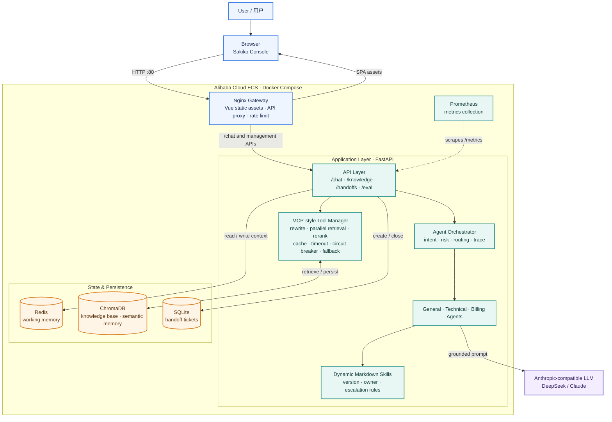
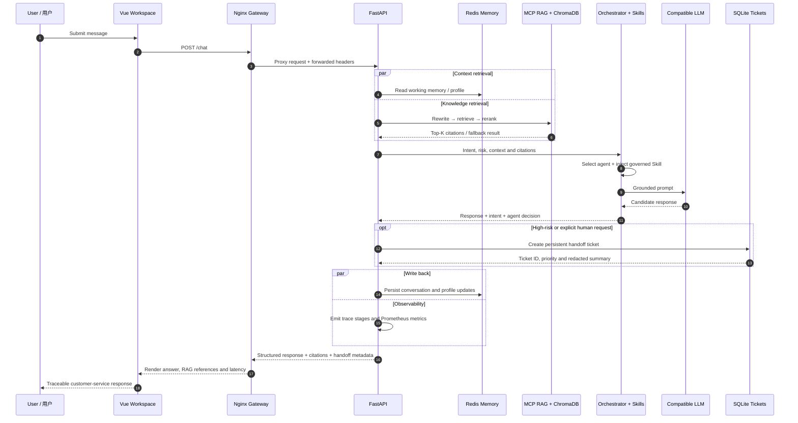

# SakikoMind · Enterprise AI Customer-Service Agent

> **Enterprise AI customer-service platform with hybrid intent recognition, multi-agent orchestration, MCP-powered RAG, dynamic Skills, memory, human handoff, observability and evaluation.**  
> **SakikoMind是一款企业级 AI 智能客服 Agent 平台，融合三路意图识别、多 Agent 编排、MCP 工具化 RAG、动态 Skills、记忆、人工升级、可观测性与评测闭环。**

[Live Demo](http://120.26.144.124/) · [API Docs](http://120.26.144.124/docs) · [Cloud Deployment Guide](SakikoMind/云端部署指南.md) · [Demo Script](SakikoMind/演示脚本.md)

## Why SakikoMind? | 项目亮点

| Capability | What it delivers |
| --- | --- |
| **Hybrid intent recognition** | Combines LLM semantic understanding, embedding similarity and keyword patterns to produce intent, confidence, urgency and structured entities. |
| **Multi-agent orchestration** | Routes requests to general, technical and billing agents; high-risk cases generate persistent human-handoff tickets. |
| **Grounded RAG** | Uses query rewriting, parallel retrieval, keyword weighting and reranking; each response returns traceable policy citations. |
| **Governed Skills** | Hot-loads Markdown Skills with owner, version, escalation criteria and prohibited commitments. |
| **Memory and tools** | Uses Redis working memory plus ChromaDB semantic memory; MCP-style tools provide validation, cache, timeout, circuit breaking and fallback. |
| **Quality engineering** | Adds trace IDs, Prometheus metrics, LLM-as-Judge evaluation, timestamped snapshots and deterministic regression suites. |

**中文说明：** SakikoMind 面向订阅制 SaaS 客服场景，将业务政策、处理规范和模型能力解耦：易变化事实交给可追溯知识库，流程、安全边界和人工升级条件交给 Skills 治理，复杂请求由多 Agent 协作处理。

## Architecture | 系统架构



**Deployment notes | 部署说明：** only Nginx exposes port `80` in production. FastAPI, Redis and ChromaDB communicate on the Docker-internal network; Prometheus binds to `127.0.0.1:9090` for SSH-tunnel access.
**生产部署说明：** 公网仅由 Nginx 暴露 `80` 端口。FastAPI、Redis 与 ChromaDB 仅通过 Docker 内部网络通信；Prometheus 绑定到 `127.0.0.1:9090`，通过 SSH 隧道按需访问。

### `/chat` Request Lifecycle | `/chat` 请求时序



**Design principle | 设计原则：** facts come from retrievable policy documents, response boundaries come from governed Skills, and operational decisions remain traceable through `trace_id`, citations and persistent handoff tickets.
**设计原则：** 易变化的业务事实来自可检索政策文档，话术边界与升级条件来自受治理的 Skills；每次决策通过 `trace_id`、引用和持久化工单保留可追溯证据。

## Production Highlights | 工程化能力

- **Traceable answers | 可追溯回答：** `/chat` returns `trace_id`, RAG citations, matched Skills and handoff metadata; the Vue workspace renders them with each answer.
- **Controlled human handoff | 受控人工升级：** payment disputes, account-security issues, privacy requests and explicit human requests create persistent tickets with priority and redacted summaries.
- **Observable runtime | 运行可观测：** `/monitor` and `/metrics` expose HTTP, RAG, agent and memory-stage latency/error signals for Prometheus collection.
- **Cloud-ready delivery | 云端可交付：** Docker Compose runs FastAPI, Redis, ChromaDB, Prometheus and Nginx; production override keeps internal services off the public network.

## Validation Baseline | 测试与评测基线

| Item | Baseline |
| --- | --- |
| Fixed end-to-end cases | **20 / 20** structured regression cases passed |
| Offline regression | **27** deterministic tests covering Skills, handoffs, tracing, RAG fallback, evaluation snapshots and monitoring alerts |
| Evaluation dimensions | relevance, accuracy, completeness and helpfulness via **LLM-as-Judge** |
| Regression evidence | timestamped evaluation snapshots and failure summaries under `data/eval/` |

**中文说明：** 固定样本会验证 `/chat` 返回的意图、Agent、升级决定、工单原因与优先级、Skill 命中和知识引用；评测结果会保留时间戳快照，便于对比每次优化是否引入回归。

## Tech Stack | 技术栈

- **Backend:** Python, FastAPI, Anthropic-compatible API, Docker Compose
- **Frontend:** Vue 3, Vite, Nginx
- **Data & memory:** Redis, ChromaDB, SQLite
- **RAG & agent:** MCP-style tool management, dynamic Markdown Skills, multi-agent orchestration
- **Observability & quality:** Prometheus, Trace ID, LLM-as-Judge, offline regression tests

## Repository Layout | 目录结构

```text
SakikoMind/
├── SakikoMind/             # Python FastAPI service, agents, RAG, Skills and evaluation
├── SakikoMindFrontend/     # Vue workspace and Nginx gateway assets
├── SakikoMindJava/         # Java / Spring AI implementation reference
└── README.md               # Bilingual project overview
```

## Quick Start | 本地启动

### 1. Configure the model service | 配置模型服务

```powershell
cd SakikoMind
Copy-Item .env.example .env
```

Edit `.env` and set a valid Anthropic-compatible provider configuration:

```env
ANTHROPIC_BASE_URL=https://api.deepseek.com/anthropic
ANTHROPIC_MODEL=your_model_name
ANTHROPIC_API_KEY=your_api_key
```

> Never commit `.env`, API keys, user conversations or production data.  
> 请勿提交 `.env`、API Key、用户对话或生产数据。

### 2. Start the full stack | 启动全栈服务

```powershell
docker compose up -d --build
docker compose ps
curl http://localhost:8000/health
```

### 3. Run the Vue workspace | 启动 Vue 工作台

```powershell
cd ..\SakikoMindFrontend
npm install
npm run dev
```

Open the Vite URL (usually `http://127.0.0.1:5173`) and start a customer-service conversation.

## Key Endpoints | 核心接口

| Endpoint | Purpose |
| --- | --- |
| `POST /chat` | Customer-service conversation, routing, RAG citations and handoff result |
| `GET /skills` / `POST /skills/reload` | Inspect and hot-reload governed Skills |
| `GET /handoffs` | Query persistent human-handoff tickets |
| `GET /knowledge/stats` | Inspect knowledge-base statistics |
| `GET /monitor` / `GET /metrics` | Runtime monitoring and Prometheus metrics |
| `POST /eval/run` | Run end-to-end evaluation |

See [Swagger API Docs](http://120.26.144.124/docs) for interactive requests.  
完整部署、排障与 HTTPS 建议请参考 [云端部署指南](SakikoMind/云端部署指南.md)。

## Security Notes | 安全边界

- Keep Redis, ChromaDB and Prometheus on the internal Docker network; expose only `80/443` in production.
- Restrict CORS to known frontend origins and add administrator authorization before exposing write endpoints.
- Use simulated, anonymized policies and test conversations for demonstration; never upload real customer data.

## Roadmap | 后续方向

- Expand high-quality, labeled customer-service exemplars for more natural and empathetic responses.
- Add administrator authentication and external ticket-platform integration.
- Add CI for API, frontend end-to-end and security regression checks.
- Bind a domain and terminate HTTPS through Caddy, CDN or a cloud load balancer.

---

Built as an end-to-end AI Agent engineering project, from RAG and Skills governance to evaluation, observability and cloud deployment.  
作为端到端 AI Agent 工程项目构建，覆盖 RAG、Skills 治理、评测、可观测性与云端部署。
