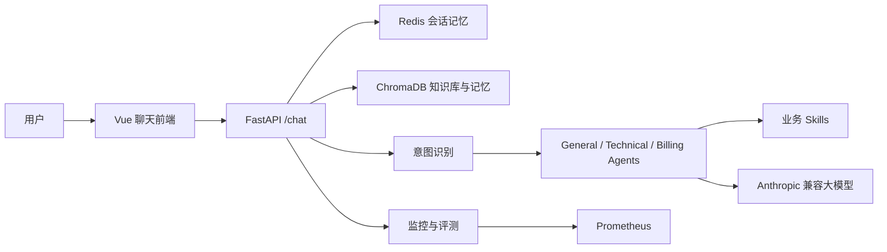

# SakikoMind：可观测、可追溯的企业智能客服 Agent

SakikoMind 是一个面向企业客服场景的多 Agent 系统。它通过意图识别将请求路由到通用、技术或账单 Agent，结合可热加载的业务 Skills、Redis 会话记忆、ChromaDB 知识库与 DeepSeek 等 Anthropic 兼容模型生成可追溯的客服回答。

> 本项目当前唯一演示主线为：`Vue 前端 -> Python FastAPI -> Redis + ChromaDB -> Anthropic 兼容大模型`。

## 目录

- [核心能力](#核心能力)
- [系统架构](#系统架构)
- [快速启动](#快速启动)
- [前后端联调](#前后端联调)
- [接口与监控](#接口与监控)
- [评测基线](#评测基线)
- [项目结构](#项目结构)
- [已知限制与下一步](#已知限制与下一步)
- [安全说明](#安全说明)

## 核心能力

- **多 Agent 路由**：根据用户意图分发至 `general`、`technical`、`billing` Agent，并在高风险场景建议人工介入。
- **Skills 热加载**：运行时读取 `skills/*/SKILL.md`，以版本、负责人、升级条件和禁止承诺治理业务规则；通过 `/skills/reload` 无需重启即可刷新。
- **可解释 RAG**：查询改写、并行召回、关键词加权与重排后，将相关知识库内容注入模型上下文，并随回复返回来源摘要。
- **三层记忆**：Redis 工作记忆与会话摘要，配合 ChromaDB 情景记忆和用户画像。
- **工具治理**：知识库工具提供超时、缓存、熔断、降级与统计能力。
- **评测与监控**：内置意图识别和端到端评测；通过 `/monitor`、`/metrics` 与 Prometheus 观察运行状态。

## 系统架构



一次对话的核心流程：

```text
POST /chat
  -> 读取 Redis 会话上下文和 ChromaDB 相关记忆
  -> 检索业务知识库
  -> 识别意图、风险与升级需求
  -> 路由 Agent，并注入匹配的 Skill
  -> 调用大模型生成回复
  -> 写回会话记忆，记录监控指标
```

## 快速启动

### 1. 前置条件

- Docker Desktop（Windows）或 Docker Engine（Linux）
- Docker Compose
- 一个 Anthropic API Key，或兼容 Anthropic 协议的模型服务 API Key
- Node.js LTS 与 npm（仅前端开发需要）

### 2. 配置环境变量

在项目根目录复制示例文件：

```powershell
Copy-Item .env.example .env
```

编辑 `.env`，至少配置模型服务：

```env
ANTHROPIC_BASE_URL=https://api.deepseek.com/anthropic
ANTHROPIC_MODEL=your_model_name
ANTHROPIC_API_KEY=your_api_key
```

不要提交 `.env`，不要在日志、截图或聊天记录中泄露 API Key。

### 3. 启动后端全栈服务

```powershell
docker compose up -d --build
docker compose ps
```

预期运行以下五个服务：

| 服务 | 说明 | 默认端口 |
| --- | --- | --- |
| `sakikomind` | Python FastAPI 应用 | `8000` |
| `redis` | 工作记忆与会话摘要 | `6379` |
| `chromadb` | RAG、情景记忆与用户画像 | `8001` |
| `prometheus` | 指标采集 | `9090` |
| `nginx` | 反向代理入口 | `80` |

### 4. 验证服务

```powershell
curl http://localhost:8000/health
curl http://localhost:8000/skills
curl http://localhost:8000/knowledge/stats
```

健康状态应返回 `status: ok`；`/skills` 当前加载 7 类业务 Skill；`/knowledge/stats` 默认有演示知识片段。

## 前后端联调

后端启动后，在 `SakikoMindFrontend` 目录运行：

```powershell
npm install
npm run dev
```

浏览器打开 Vite 输出的地址，默认通常为 `http://127.0.0.1:5173`。前端默认请求 `http://localhost:8000`，可在左侧“API 地址”中按需修改。

已完成的一次真实联调：

```text
用户：你好，我想申请退款，应该怎么处理？
结果：前端成功调用 FastAPI，后端完成 RAG 检索并返回退款处理建议。
响应元信息：intent=request，agent_type=general，knowledge_used=true。
```

该结果证明浏览器前端、Python API、知识库和模型服务链路可用。退款场景当前仍可能路由到 `general`，详见“已知限制与下一步”。

### 可解释 RAG 验证

知识库已扩展为 25 篇“订阅制 SaaS 客服”模拟政策，并保留 `source_id`、版本、生效日期和适用范围等元数据。当前运行环境只保留这 25 个可追溯的 SaaS 政策片段。

已验证问题“首次购买专业版后多久可以申请退款？”会在 `/chat` 响应的 `citations` 中返回 `SaaS-REFUND-001`，前端会在 AI 回复下展示“参考资料”。这使用户能够看到答案参考的政策，而不是只看到 `knowledge_used: true`。

### Skills 治理验证

原有通用客服、账单退款、技术支持三类业务 Skill 均为 `v1.1`，并明确负责人、最后修改日期、升级条件和禁止承诺。新增四类 `v1.0` 治理 Skill：账号安全与身份核验、生产故障分级、数据隐私与删除请求、订阅变更与配额管理。

当前共 7 项 Skill。它们只治理处理流程、安全边界和人工升级；套餐、退款等易变化事实仍由可追溯 RAG 知识库提供。命中 Skill 明确配置的升级关键词时，后端会稳定返回 `escalated: true`，不只依赖模型自行判断。`/chat` 会返回 `skills_used`，前端会在每条 AI 回复下显示本次生效规则；左侧“业务 Skills”面板可查看已加载规则并调用热更新。

已验证问题“我的银行卡被重复扣款了，请帮我处理。”会路由到 `billing` Agent，并返回“账单退款处理规范 v1.1”，其命中关键词为“重复扣款”。

新增 Skill 已通过热加载验证：异常登录场景命中“账号安全与身份核验规范 v1.0”，大面积 `503` 场景命中“生产故障分级与升级规范 v1.0”；两类场景均稳定返回 `escalated: true`。

### 人工升级工单验证

当请求需要人工处理时，`/chat` 会在响应中返回 `handoff_ticket`，其中包含工单号、升级原因、优先级、脱敏问题摘要、时间戳和本次引用的来源 ID。工单会写入 `data/handoffs/tickets.db`，应用重启后仍可通过 `GET /handoffs` 查询，并通过 `PATCH /handoffs/{ticket_id}` 更新为处理中、已解决或已关闭。

升级原因目前覆盖 `payment_dispute`、`account_security`、`tool_failure`、`privacy_request`、`user_requested_human`、`abusive_or_complaint` 与 `low_grounding`。重复扣款和账号安全场景已验证生成 `P1` 工单；前端会在聊天回复下显示工单卡片，并在“人工工单中心”中展示和更新处理状态。

> 当前实现是 SakikoMind 自带的单实例工单中心，不依赖第三方服务。公开部署前必须为工单更新接口增加管理员鉴权，并在需要外部通知时再单独接入企业客服或工单平台。

### 请求链路追踪验证

每个 HTTP 请求都会获得独立 `trace_id`。客户端可通过 `X-Trace-ID` 请求头传入安全字符组成的标识；未传入时由服务端自动生成。`/chat` 会在响应正文和 `X-Trace-ID` 响应头中回传同一值，并将其贯穿记忆读取、RAG 查询改写与工具调用、Agent 意图路由、记忆写入、升级决定和人工工单。

前端会在 AI 回复与人工工单旁展示 Trace。排障时可执行 `docker compose logs sakikomind`，再按 `trace_id` 搜索单次请求的完整阶段日志。现有 SQLite 工单库会在启动时自动补充 `trace_id` 列，不需要手工删除或重建数据库。

## 接口与监控

| 地址 | 用途 |
| --- | --- |
| `http://localhost:8000/docs` | Swagger 接口文档与开发调试 |
| `http://localhost:8000/health` | 服务健康检查 |
| `http://localhost:8000/skills` | 已加载 Skills |
| `http://localhost:8000/handoffs` | 内置人工工单队列 |
| `http://localhost:8000/knowledge/stats` | 知识库片段统计 |
| `http://localhost:8000/monitor` | Agent 与工具监控状态 |
| `http://localhost:8000/metrics` | Prometheus 格式的 HTTP、对话阶段和画像更新指标 |
| `http://localhost:8000/eval/run` | 端到端评测入口 |
| `http://localhost:9090` | Prometheus 指标界面 |
| `http://localhost/health` | Nginx 反向代理健康检查 |

常用排障命令：

```powershell
docker compose ps
docker compose logs -f sakikomind
docker compose logs -f nginx
```

模型调用失败时，优先通过 `docker compose logs -f sakikomind` 区分 API Key、账户余额、Redis、ChromaDB 或模型请求问题。

## 自动化回归与评测基线

不调用真实模型的核心回归测试使用 Python 内置测试框架运行：

```powershell
docker compose exec -T sakikomind python -m unittest discover -s tests -v
```

当前共有 27 项离线回归测试，覆盖 Skill 升级关键词、SQLite 工单创建与重启后的状态持久化、旧工单库迁移、trace ID 规范化、固定评测集加载、LLM Judge JSON 解析、RAG 确定性排序、高风险意图路由、告警去重与恢复、查询改写/重排超时降级，以及异步用户画像更新重试。

固定评测集位于 `data/eval/fixed_cases.json`，包含 20 条意图标注样本，覆盖全部 10 类意图；`/eval/run` 会在响应中返回意图误判、真实低分对话和 Judge 未定论三类失败摘要。

最近一次完整端到端评测结果：

| 指标 | 当前结果 |
| --- | --- |
| 评测项数 | 8 |
| 通过项数 | 7 |
| 通过率 | 87.5% |
| 意图样本数 | 20 |
| 意图识别准确率 | 90% |
| 回答相关性 | 0.9214 |
| 回答准确性 | 0.9143 |
| 回答完整性 | 0.6071 |
| 回答帮助性 | 0.7929 |
| Judge 未定论 | 1 条 |

基线文件位于 `data/eval/baseline.json`，每次运行会覆盖为最新结果；同时会自动生成 UTF-8 时间戳快照到 `data/eval/snapshots/`。本次完整快照为 `data/eval/snapshots/eval-20260807T162540535923.json`，可解释 RAG 改造后的历史快照仍保留在 `data/eval/baseline-2026-08-07-rag-citations.json`。

LLM Judge 会对空响应或不完整 JSON 自动重试最多三次；三次仍失败的样本会标记为“未定论”，不再混入质量均分和通过率。固定样本中已移除套餐降级这类意图边界模糊的案例，避免把分类定义争议误判为模型退化。

此外，`data/eval/fixed_cases_20.json` 提供 20 条结构化真实链路样本，逐条校验 `/chat` 返回的意图、Agent、升级决定、工单原因与优先级、Skill 命中和知识来源。运行命令如下：

```powershell
docker compose exec -T sakikomind python evaluation/run_fixed_regression.py --workers 4
```

固定集从首轮 9/20（45%）提升到 14/20（70%）、18/20（90%），最终达到 20/20（100%）。最终报告为 `data/eval/fixed-reports/fixed-20260807T164223Z.json`；本轮总耗时 188.2 秒，平均单请求 27.7 秒，P95 为 35.2 秒，最大值 74.6 秒。功能正确性已达当前基线，下一阶段重点是超时降级、链路追踪和延迟拆分。

人工测试过程与问题汇总见 [`测试报告.txt`](测试报告.txt)。

## 项目结构

```text
SakikoMind/
├── api/                # FastAPI 入口与接口定义
├── agents/             # 多 Agent 路由与编排
├── core/               # 意图识别、Skill 加载等核心能力
├── memory/             # Redis 与 ChromaDB 记忆管理
├── mcp/                # 知识库与工具治理
├── monitor/            # 运行监控与 Prometheus 指标
├── evaluation/         # 端到端评测
├── skills/             # 可热加载业务规则
├── data/               # 演示知识、ChromaDB 与评测基线
│   └── demo_docs/saas_policies.json  # 25 篇订阅制 SaaS 模拟政策
├── config/nginx/       # Nginx 反向代理配置
├── docker-compose.yml  # 全栈容器编排
└── .env.example        # 环境变量模板
```

前端位于同级目录 `../SakikoMindFrontend`，使用 Vue + Vite 构建，默认连接本项目的 Python FastAPI 服务。它已整理为对话、知识库、人工工单、运行监控四个工作区；对话页提供退款政策、401 排障和高风险转人工三条不会自动发送的演示捷径。可直接按 `演示脚本.md` 完成五分钟录屏。

云端部署请使用 `docker-compose.production.yml` 覆盖本地端口暴露，并按 `云端部署指南.md` 配置随机 Redis 密码、CORS 白名单与 HTTPS。

## 已知限制与下一步

当前项目已完成 Docker 全栈、真实模型调用、Swagger 测试、前后端聊天联调、真实人工工单中心、20/20 固定链路基线，以及可靠性与可观测性的第一轮改造。当前 `/metrics` 可采集 HTTP 成功率与延迟、`memory_read`/`rag`/`agent`/`memory_write` 阶段耗时和失败次数，以及异步用户画像更新的尝试/失败次数；查询改写和重排调用默认 8 秒超时后会确定性降级，告警恢复后会标记为 `resolved`。下一轮迭代重点如下：

1. 为人工工单创建/状态更新、模型供应商错误类型补充细粒度指标与告警规则。
2. 收紧 CORS、Redis 密码和知识库写接口权限。
3. 增加 API 集成测试、前端端到端测试与 CI 自动执行。
4. 在核心功能稳定后部署到云端 Linux 服务器，并使用 HTTPS 域名提供服务。

## 安全说明

- `.env`、API Key、Redis 密码、用户对话和上传文档均属于敏感数据，不应提交至 Git。
- 生产部署仅开放 `80/443`；Redis、ChromaDB 与 Prometheus 应保持内网访问。
- 生产环境应将 CORS 从 `*` 改为明确的前端域名白名单。
- `/knowledge/add`、`/knowledge/upload` 与 `/skills/reload` 等写操作应受管理员认证保护。
- 示例知识库与测试对话均应使用模拟数据，不应导入真实用户隐私或生产订单信息。
